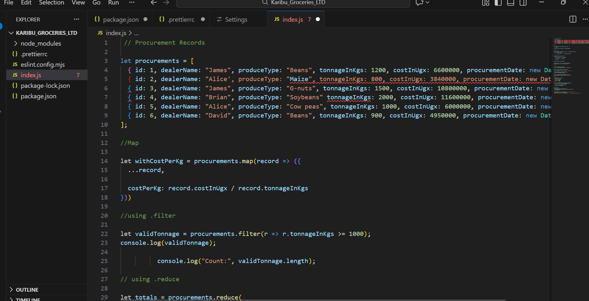
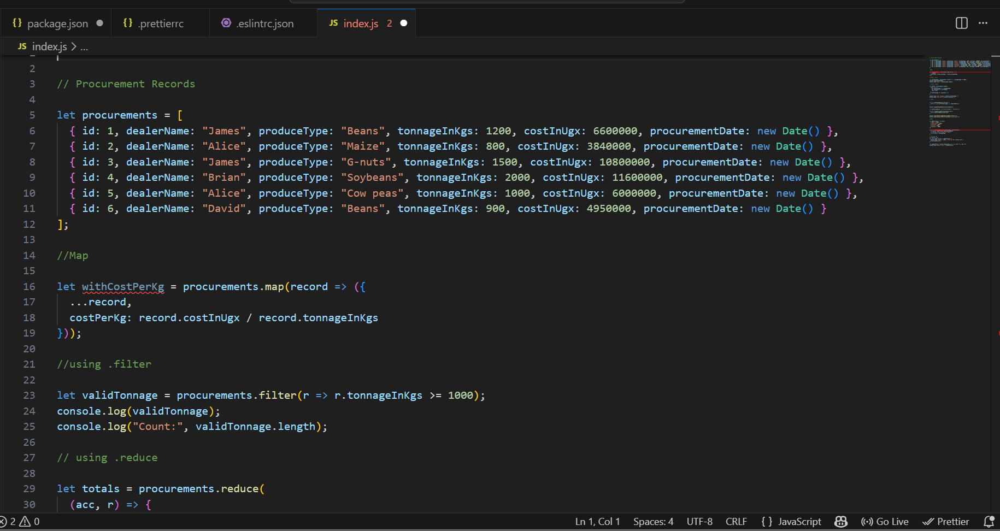

# Karibu Groceries – ESLint & Prettier Setup

## Steps Taken
- Installed ESLint and Prettier with npm
- Created `.eslintrc.json` and `.prettierrc` config files
- Ran ESLint to check and fix issues
- Formatted all files with Prettier
- Enabled format on save in VS Code

## Issues Fixed
- Added missing semicolons
- Changed double quotes to single quotes
- Fixed spacing and indentation

## 📸 Screenshots

**Before formatting:**

**After formatting:**

## Submission
GitHub repo link: [https://github.com/Wisdom-wisely-Samson/My_ESLint_and_Prettier_assignments.git]